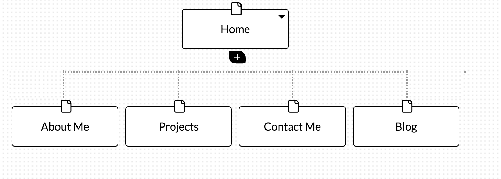

##What are the 6 Phases of Web Design?
The following are the 6 phases of Web Design:
1) Gathering Information
In this first phase, the web designer will establish the purpose of the website. This includes considering the objective of the website, who is the target audience and the type of content that will be present on the website. This then leads to the second stage.
2) Planning
After condering the factors in the first stage, the web designer then creates a site map. This is crucial as it will show all the topics and sub-topics that the website will show. Ease of navigation is crucial and a good user interface needs to be implemented to ensure the end user is satisfied.
3)Design
After gathering information and planning, the next step is the design. The design stage will establish the look and style of the website. After considering the goals and target audience, the web designer establishes a wireframe to demonstrate the look and feel.
4) Development
This is the stage where the actual building or code behind the website is done. After establishing the look and feel of the website, the web designer will work on creating a functional website with the use of HTML and CSS (for style). In other words, where front end development will come into play.
5) Testing and delivery
This is the phase after building the functional website. The web designer makes sure the website properly works by testing every page, the scripts or forms on the website and making sure it is compatible with web browsers. The web designer also runs a validation test to make sure the code in the website functions properly.This leads us to the final stage: Maintenance.
6) Maintenance
This is the stage after delivering the product. The web designers' work isn't necessarily over: He continues maintenance on the website from time to time to make sure everything runs smoothly or adding new features to the website depending on the understanding between the client and the web designer. The web designer can also choose to provide the necessary kit to the client to give him the power to do the maintenance himself.
##What is your site's primary goal or purpose? What kind of content will your site feature?
Seeing as this is my first website, it will coincide with my growth and learning at DBC. I'd like to demonstrate some of the projects I work on and be involved in blogging about my experience at DBC. The content will primarily be blogging about my experience and tech related information as well as any projects I get to work on ( eg:github)
##What is your target audience's interests and how do you see your site addressing them?
The target audience is other cohorts or hopefully people interested in joining DBC. This will allow them to see the improvement throughout the learning and the application of the concepts learned in a well designed website. The target audience will be those interested in GitHub projects and collaborative projects and the blogging of what is is to work on these sorts of projects in teams.The website will address this with the blogging section.
##What is the primary "action" the user should take when coming to your site? Do you want them to search for information, contact you, or see your portfolio? It's ok to have several actions at once, or different actions for different kinds of visitors.
The primary action i'd like users to take when on the website is to first look at the portfolio ( projects) that I worked on - To follow up with the blog and any information that pertains to the projects and finish hopefully with the contact section where my contact information will be located(GitHub,LinkedIn,Twitter etc...)
##What are the main things someone should know about design and user experience?
Design and User experience involve the process of ensuring client satisfaction by making sure that usability, ease of access, and utility are respected in the interaction between the end user and the product. Essentially it involves creating a feeling of satisfaction when using the product by making sure these different factors are respect (system performance,accessibility,usability etc...)
##What is user experience design and why is it valuable? 
Design with the user experience as the forefront. Meaning we consider the end users satisfaction when interacting with the product. This is ever more important with the advent of the web and different platforms. The web has grown exponentially and websites are even more complex than ever. What truly creates a lasting impression is the experience the user gets when using the product. It's about making sure user satisfaction when navigating the website.
##Which parts of the challenge did you find tedious?
The part that I had trouble with was appending the site map to the design-reflection.md file. I finally realized that the path I had set when using the markdown image inline with relative path should have been simple as the file was located in the same directory as the design-reflection.md file. After a bit of testing I finally managed to get the image to load. I found the rest of the challenge very informative especially the importance of design and the phases that are involved in the creation of a website.