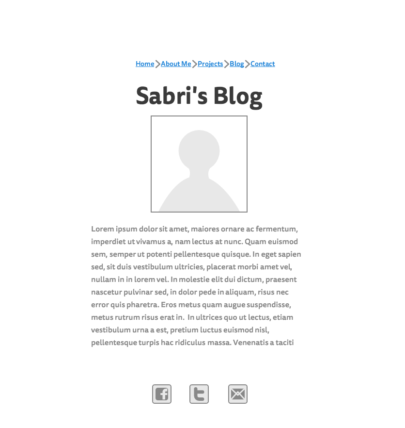
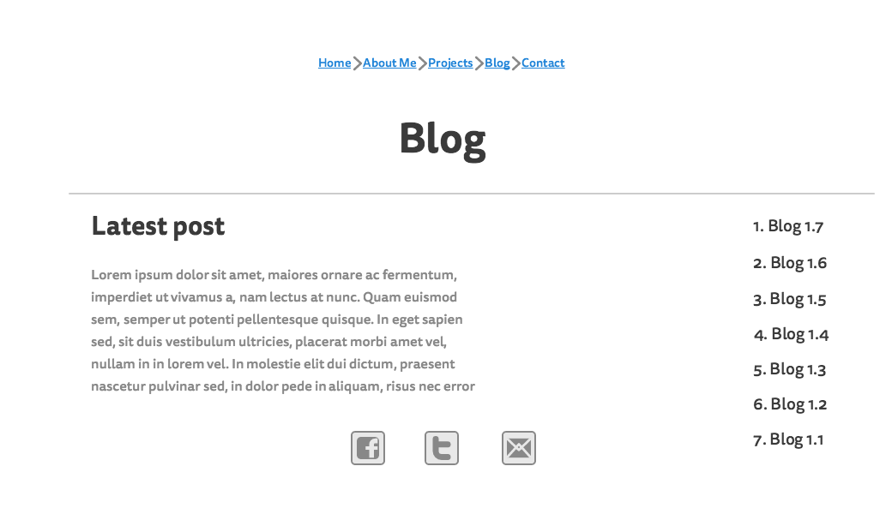

##What is a wireframe?
A wireframe is a visual representation of the skeleton of a website. It consists of visual elements to ease set the foundation for the website. Just like architects work with blueprints before building a home, a wireframe is a blueprint before building the website and displays the layout and the elements and their arrangement on the respective website.
##What are the benefits of wireframing?
Wireframing helps by visually assigning elements required on the website. This greatly influences and assists in the coding process of the website, it also helps designing a user friendly website because you can clearly see what is required and the arrangement required for user accessibility. It also helps because you can change elements on the wireframe before developing the website to improve the design with ease.
##Did you enjoy wireframing your site?
Yes I did. I had a bit of trouble at the beginning because I had no idea where to start as this is the first time I'm doing this. But I opted for a simple design ( simple but efficient) in order to properly convey what will be posted on the website. It's a great learning process and one I will most likely improve with experience ( the arrangement of elements etc...)
##Did you revise your wireframe or stick with your first idea?
I did an initial wireframe for my website Index but decided to change it a bit. I found it was a bit clogged with the image and text and all so I went for a simpler wireframe. I timeboxed myself as well because as per the instructions its easy to fall in a  rabbit hole. You start changing things, adding more elements and it ends up being convoluted. 
##What questions did you ask during this challenge? What resources did you find to help you answer them?
I asked myself What wireframe could I go for that is simple but packs content. I opted for a simple design by typically focusing on the objective of my website which is simply to explore projects that I work on and blog posts as well. I used the resources in the challenge "A Beginners Guide to Wireframing" and I also looked at a few Squarespace template websites because they opt for simplicity but beauty in design. I can't wait to see how it looks after CSS.
##Which parts of the challenge did you enjoy and which parts did you find tedious?
I enjoyed the end result mostly and playing around with elements and creating something that will eventually become a full website with code and CSS. What I found tedious at first was where to start. It's a bit hard to dive in your first timeand create a wireframe even with resources available because of lack of experience. However, I'm certain that will change with practice as I build more websites and practice finishing this one. 