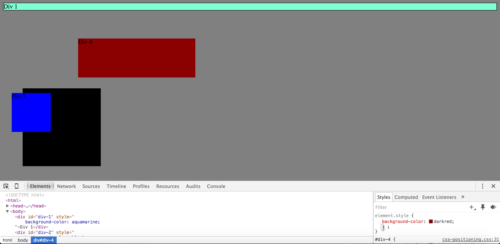
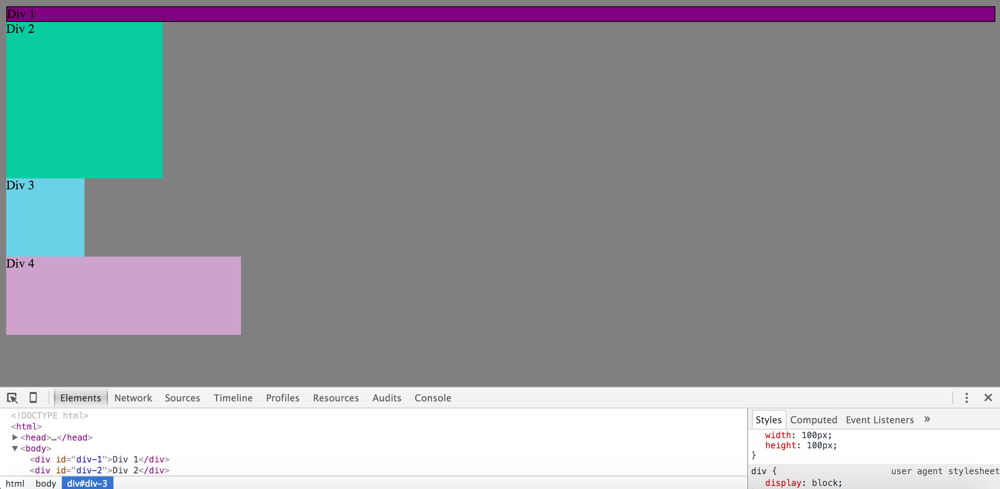
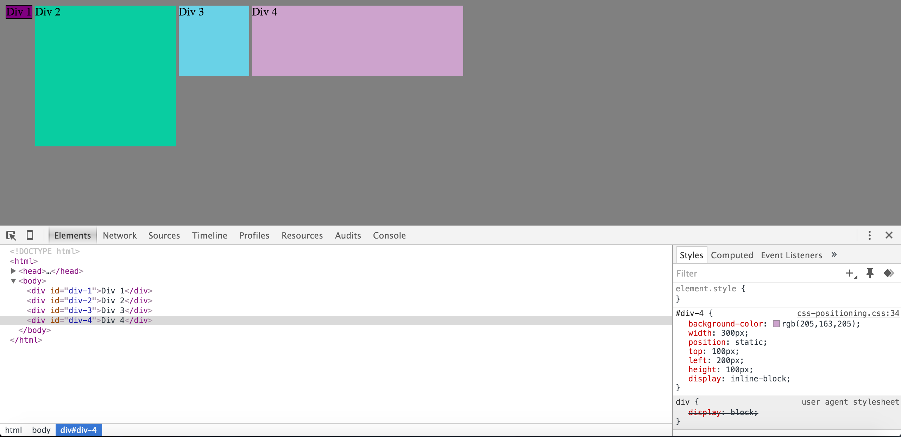
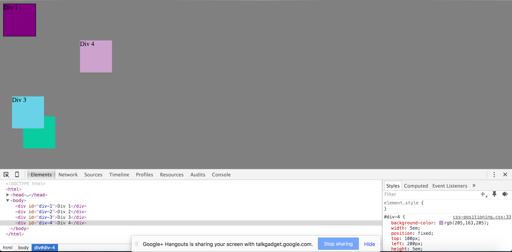
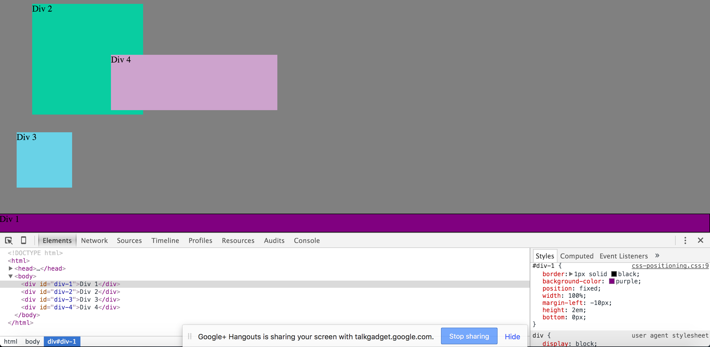
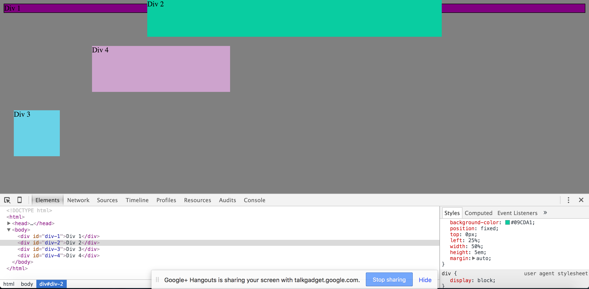
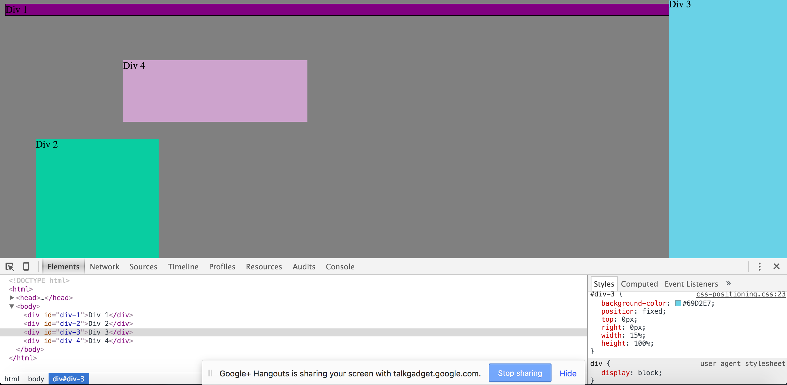
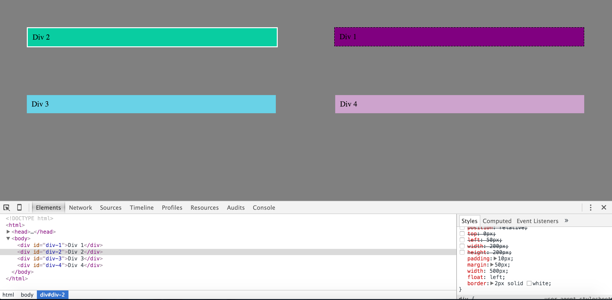

##How can you use Chrome's DevTools inspector to help you format or position elements?
Chrome's devtools allow you to inspect the element and access the source of the page. What this means is that you get access to HTML, CSS and Javascript of the webbpage.Essentially by accessing Chrome's devtools you can visually see how the property and values affect the position of the elements on your webbpage as opposed to writing all the code and then seeing it once you open the page. 
##How can you resize elements on the DOM using CSS?
CSS essentially sees each element in its own Box. What this means is that you can position the box within the context of the webbpage by adjusting the boxes width or height accordingly. Certain elements are seen as block elements ( h1,p for example) which start on a new line and there are inline elements such as imgs that flow in content of the text.
##What are the differences between absolute, fixed, static, and relative positioning? Which did you find easiest to use?
I had to do a bit of research regarding this and I find it was the hardest part to really grasp about CSS. Basically static is the default positioning also called normal flow. Each static element will appear as a box on top of another (which is the normal flow of elements) Relative positioning allows the change of positioning of the element relative to its normal flow( eg changing its top or left relative to static positioning) Absolute positioning is basically the positioning of the element in regards to its containing element ( or parent) so for example if you have a 
 tag and a 
 within that tag the absolute positioning of the 
 would be in regards to the 
 box. Absolute positioning will move as the user scrolls up and down which leads us to fixed positioning. Fixed positioning will not move when the user scrolls up and down and is essentially fixed to the browser window .Both absolute and fixed positioning do not affect the position of surrounding elements. I felt the easiest to use was the basic one at first which is the static when going through the challenge but as I become more confident with other types of positioning I shouldn't have any problems.
##Which was most difficult?
I'd say most of them considering I wasn't too sure what they each represented. I read the online resources but had to view the difference and found the HTML CSS book that was recommended the most helpful.
##What are the differences between margin, border, and padding?
We have to look at it as a box. Between the content and the border is the padding which is very important for readability as it represents the area between the content and its edges. Adding width to the padding adds width to the border as well and makes the content more readable. The margin represents the space between the border and surrounding elements. Thinking of a box, increasing the margin increases the space between elements.
##What was your impression of this challenge overall? (love, hate, and why?
A mixed bag to be honest. It's mostly understanding the positioning that I had a bit of trouble with but am starting to become more comfortable. I absolutely agree with the statement of CSS being mostly trial and error which was a significant part of this challenge ( which is probably why it was a bit frustrating) but once I became a bit more confident It became a bit easier. What i love the most is making use of Chrome DevTools and realizing how incredibly useful it is as a web developer.