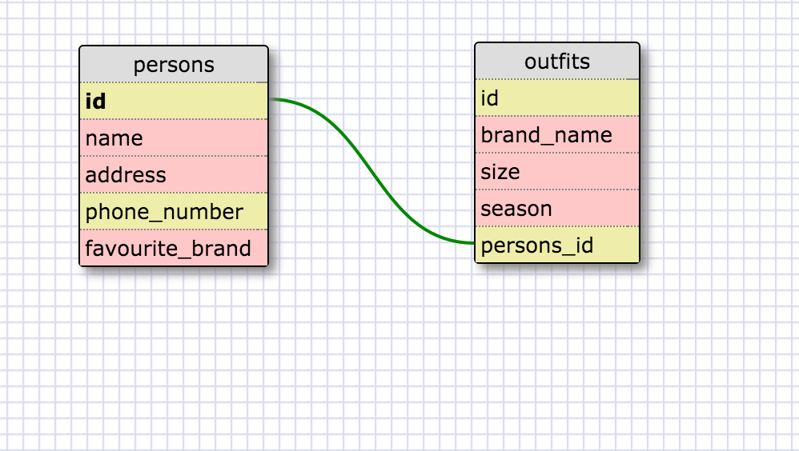

1. select * from states;
2. select * from regions;
3.select state_name,population from states;
4.select state_name,population from states order by population desc;
5.select state_name from states where region_id =7;
6.select state_name,population_density from states where population_density >50 order by population_density asc;
7.select state_name from states where population between 1000000 and 1500000;
8.select state_name,region_id from states order by region_id asc;
9.select region_name from regions where region_name like "%central%";
10.select regions.region_name,states.state_name from regions inner join states on regions.id = states.region_id order by states.region_id asc;

What are databases for?
Databases are data structures that allow the management, organization and sorting of information(data)
What is a one-to-many relationship?
A relationship between two entities where one entity (eg:state) has one link to another entity (eg:regions) but that other entity contains MANY of the first entity(eg:states).
What is a primary key? What is a foreign key? How can you determine which is which?
A primary key is a unique identifier in a table which can not be a duplicate and cannot be a NULL value. A foreign key is an identifer in another table that can be a duplicate and a null value but which points to the primary key ( link to the primary key) in another table. The primary key is unique and cannot have any duplicates so that pretty much will show which is which ( a good example is the artists ID and albums example in codeacademy)
How can you select information out of a SQL database? What are some general guidelines for that?
we use certain syntax such as select * from (table_name) and end with a semi-colon. General guideline is that it needs to be written in caps( although I still write normally), and to end your expression with a semi-colon. Example of clauses or syntax to use : SELECT, WHERE, LIKE etc...