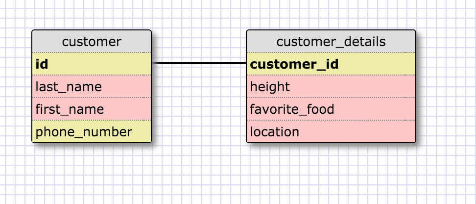
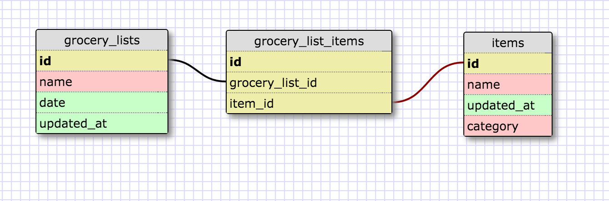

One to One Relationships

My understanding of a one to one relationship is that each row in table 1 is connected only to one row in table 2.In the example I used, we could have had customer_details rows actually be present in table 1. The cust_id represents the foreign key in table 2 . This is  a one to one relationship because each customer has one unique ID but the necessity of the second table and the fact it could fall within one table reflects this one to one relationship.

Many to Many relationships

What is a one-to-one database?
One where each characteristic of one entity can be linked with one characteristic of the second entity. In my example,
each row of table 1 is linked with one row of table 2. They specifically pertain to the same entity but consist of additional information.
When would you use a one-to-one database? (Think generally, not in terms of the example you created).
If I know i can normally display in one table all of the characteristics but choose to have a second table and a link between. Also, if most of the information could be identified as NULL it makes sense to have it as a one to one relationship.
What is a many-to-many database?
When one or more row of a table can be linked to one or more rows of a second table. In our real world example, we had artists that could collaborate on one piece of art together but each artists can also have several pieces of art which creates a many to many relationship.
When would you use a many-to-many database? (Think generally, not in terms of the example you created).
If there's a complex relationship involved when making use of the database and a link between different entitites. In this case we also make use of a join table to create the link between tables(mapping table).
What is confusing about database schemas? What makes sense?
I think it requires a certain practice in looking at it a certain way. I'm not quite there yet simply because it's something I havent seen much of. When put in context it makes a lot of sense, I guess it's just breaking in down and making a table and having the links established that's a bit complicated at this point. I find primary key and foreign key concept rather simple to understand so at least that's going great so far! 